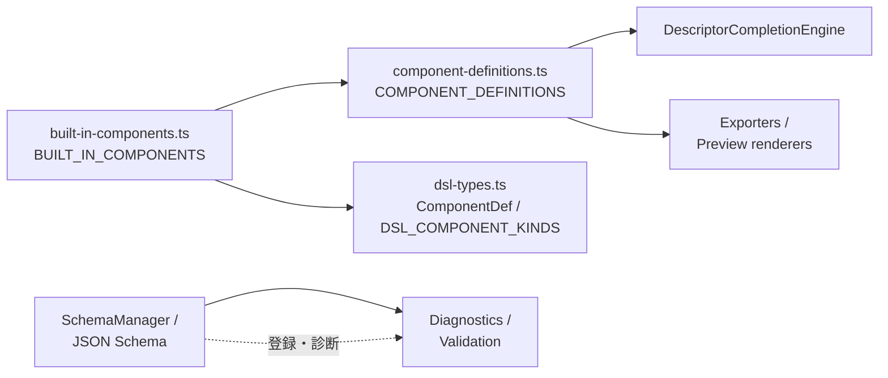

# ADR 0004: コンポーネント定義グラフを設計正本に近づける（第1段階）

**日付**: 2026-03-21  
**チケット**: T-20260321-090  
**ステータス**: 採用（第1段階・文書のみ）

## コンテキスト

外部レビューおよび深層アーキレビュー（Section C / G）より、**補完・診断・preview/export** が **descriptor / schema / registry** など層ごとに「真実」を参照しており、変更増幅時に **どの正本を更新すべきか**が即答しづらい。

## 決定（第1段階）

- **設計上の北極星**: **component definition graph**（`COMPONENT_DEFINITIONS` を中心とした descriptor グラフ）を **唯一の設計正本**に近づける。
- **schema / 補完 / preview / export** は、当面 **このグラフから派生**する経路に寄せる（root/prop メタデータを schema と二重管理しない方向を既定とする）。
- **本 ADR は文書化と可視化のみ**。層横断の一括実装は **別チケット（スライス）**に分割する。

## 現状の「正本」の所在（表）

| 領域 | 主な参照元 | 役割 |
|------|------------|------|
| 組み立て・一覧 | `COMPONENT_DEFINITIONS`（`component-definitions.ts`） | 名前・schemaRef・トークン・プレビューキー等の **グラフ** |
| DSL 中立型 | `ComponentDef` / `DSL_COMPONENT_KINDS`（`dsl-types.ts`） | YAML 構文の判別・型の正本（**built-in 名の列挙は `BUILT_IN_COMPONENTS` に統合** — T-091） |
| JSON Schema | `SchemaManager` / テンプレ生成 | 診断・登録・yaml.schemas |
| 補完 | `DescriptorCompletionEngine` + descriptor グラフ | 候補の **内容**（スキーマ全文を毎回読む実装ではない） |
| 診断 | スキーマ + DSL 検証 | エラー位置・ルール |
| Export / Preview | exporter/renderer 定義 + token マップ | 見た目・トークン解決 |

## 目標アーキ（文章）

1. **追加・変更の入口**は **定義グラフ**（またはその生成元）に集約する。
2. **Schema** はグラフと **矛盾しない派生**（生成または検証）とする。
3. **補完**はグラフ由来のメタデータを優先し、スキーマは診断・登録の別系統として維持（責務は分離したまま、**矛盾しない**ことをテストで固定）。

## 依存関係（データの流れ・Mermaid）

## 次スライス候補（起票用）

- **1 派生経路の単一化**: 補完が参照するメタデータを **descriptor グラフの単一フィールド**に寄せ、重複する参照を1つ減らす（例: プロパティ説明の出所を `COMPONENT_DEFINITIONS` に統一）。
- **スキーマと descriptor の検証**: 既存の `schema-descriptor-consistency` 系テストを拡張し、**新コンポーネント追加時のチェックリスト**（`docs/change-amplification-dsl.md`）と1対1で対応づける。

## 関連

- 親エピック: T-062（外部レビュー保守性）/ T-089（深層アーキレビュー）
- 製品要約: Vault `Tasks/Product/` のロードマップと整合
- 変更増幅: `docs/change-amplification-dsl.md`
