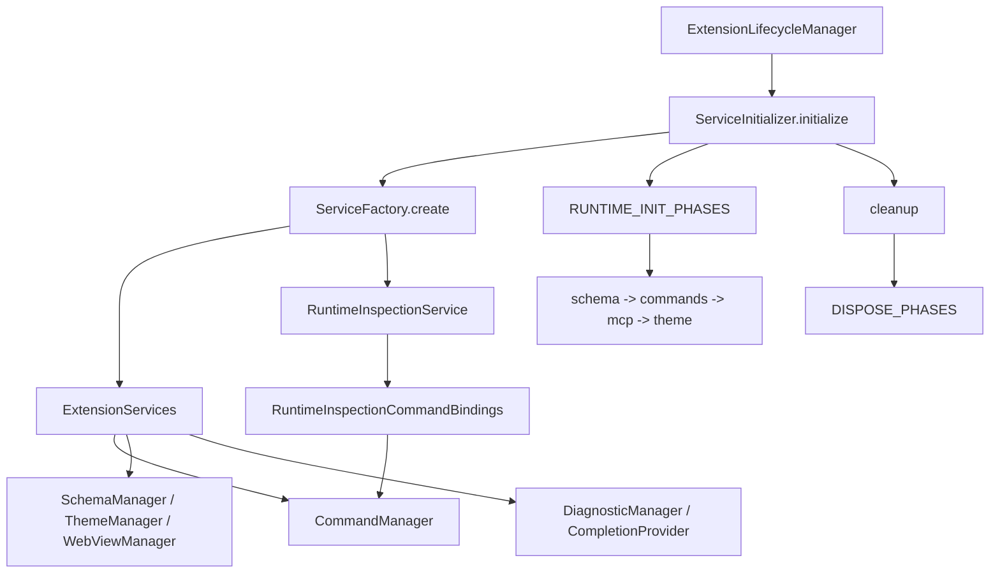

# サービス登録とランタイムフェーズ（T-20260321-001）

## 目的

拡張機能のサービスは、**生成（ファクトリ）**、**ランタイム初期化（スキーマ・コマンド・MCP・テーマ等）**、**解放（dispose）**の段階があり、それぞれ実行順序が重要になる。順序をメソッド本文に散らばらせず、**宣言的なフェーズ配列**に集約して変更点を一箇所にまとめる。

## レイヤの分担

| レイヤ | 役割 | 主なファイル |
|--------|------|----------------|
| ファクトリ | インスタンス生成。テスト用の差し替え | `src/services/service-factory.ts`、`ServiceFactoryOverrides`（`src/services/service-initializer.ts`） |
| ランタイム初期化 | 生成後の `initialize` / `registerCommands` / MCP / テーマ適用など | `src/services/service-initializer.ts`、`src/services/service-runtime-phases.ts` の `RUNTIME_INIT_PHASES` |
| 解放 | `cleanup` 順の dispose | 同 `DISPOSE_PHASES` |
| 拡張全体の activate / deactivate | メモリ追跡・性能計測・`ServiceInitializer`・Event/FileWatcher 等の順序付きオーケストレーション | `src/services/extension-lifecycle-manager.ts` が `src/services/extension-lifecycle-phases.ts` の `ACTIVATION_PHASES` / `DEACTIVATION_PHASES` を実行 |

## 関係図

## `ServiceFactoryOverrides` との関係

- **Overrides はファクトリ層専用**である。どの具象クラス（またはモック）を組み立てるかを差し替える。
- **ランタイムフェーズ**は `ExtensionServices` が揃ったあとの順序付き処理であり、Overrides と直交する。テストで Overrides を渡したうえで、同じフェーズ列が走る。

## runtime inspection の境界

- `RuntimeInspectionService` は **パフォーマンス/メモリ観測コマンドの実処理**を持つ。
- `ServiceFactory` はそのサービスを生成し、`RuntimeInspectionCommandBindings` に変換して `CommandManager` へ渡す。
- `CommandManager` は **bindings を command catalog に流し込む登録レイヤ**に留め、観測処理の実装本体は持たない。
- 追加の inspection コマンドは、まず `runtime-inspection-command-bindings.ts` と `runtime-inspection-command-entries.ts` に寄せる。`CommandManager` へ直接メソッドを生やさない。

## 関連チケット

- **T-20260320-019（初期化オーケストレーション責務分離）**  
  拡張全体の順序は **`extension-lifecycle-phases.ts`** に集約。サービス束のランタイムは引き続き **`RUNTIME_INIT_PHASES` / `DISPOSE_PHASES`（`ServiceInitializer`）** に閉じる。どちらかにステップを足すときは役割を混同しないこと。

## 新規フェーズを足すとき

1. 生成が必要なら `ServiceFactory` と型 `ExtensionServices` を見直す。
2. 起動後の処理なら `RUNTIME_INIT_PHASES` に `id` 付きで追加（順序は配列順）。
3. 解放が必要なら `DISPOSE_PHASES` に対応するステップを追加（**解放順は配列定義で明示**する）。
4. **拡張の前後処理**（メモリトラッカー・性能計測・イベント/ファイル監視の開始・停止など）は `ACTIVATION_PHASES` / `DEACTIVATION_PHASES` に追加する。
