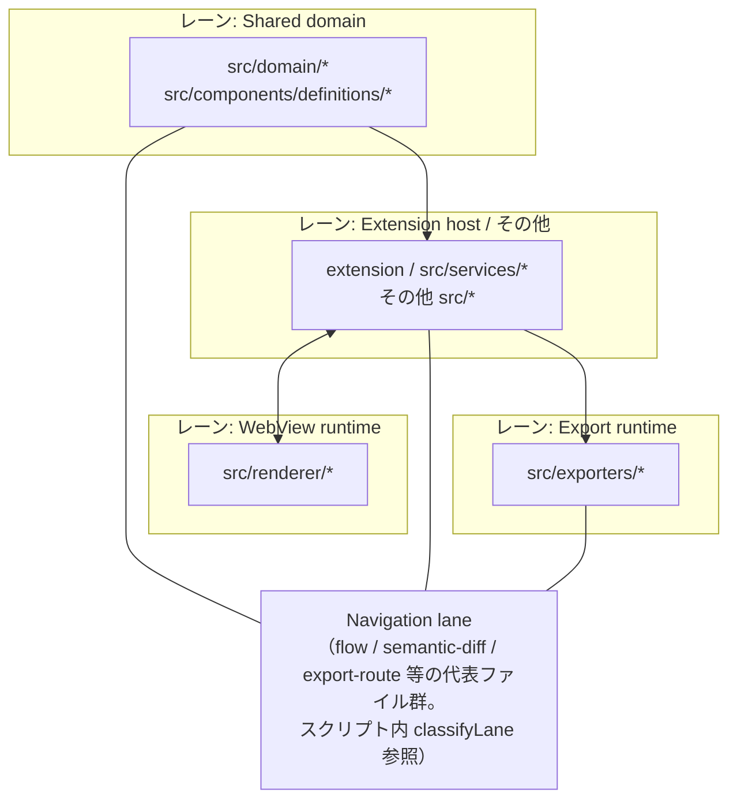

# import 境界（4 レーン）

**チケット**: T-20260321-110（本ファイルを **import ルールの人間向け正本**とする）／**T-004**（本ファイルと `scripts/check-import-graph-boundaries.cjs` の **機械チェック内容を 1:1 で同期**）  
**相互リンク**: 語彙・狙い・「やらないこと」は [architecture-review-F-boundary-roadmap.md](architecture-review-F-boundary-roadmap.md)（**T-112**）を先に読む。

## 5 分クイックスタート（import graph チェック）

- **何を固定しているか**: `npm run check:import-graph`（`scripts/check-import-graph-boundaries.cjs`）は、再流入リスクが高い **代表境界**だけを静的に検査する（4 レーン全体の完全証明ではない）。
- **いま機械的に禁止している向き（3 + Navigation 2）**:
  1. **WebView runtime → Export runtime**（`src/renderer/**` → `src/exporters/**`）
  2. **Shared domain → VS Code API**（`src/domain/**` / `src/components/definitions/**` が `vscode` を import）
  3. **Export runtime → WebView runtime**（`src/exporters/**` → `src/renderer/**`）は **下記 allowlist 以外すべて NG**
  4. **Navigation lane 代表群 → VS Code API**（`classifyLane` が `navigation-lane` と判定したファイルが `vscode` を import）
  5. **Navigation lane 代表群 → WebView**（同グループが `src/renderer/**` を相対 import で解決した依存）
- **allowlist の正本**: このファイルの [§ allowlist（Export → Renderer の橋）](#allowlist-export-to-renderer-bridge)（スクリプトの `ALLOWED_EXPORT_TO_RENDERER` と **同一の 3 エッジ**）。
- **落ちたとき**: 違反ログの `file` / `edge` を見る → **依存の向きを折り返す**（Exporter から Renderer を直接読まない、Shared domain に `vscode` を持ち込まない等）→ どうしても必要なら **専用チケットで allowlist 増減をレビュー**（スプリント外の合意事項）。

**読了の目安**: 本節 + [§ 4 レーン俯瞰図](#4-lane-overview) + [§ Import graph check](#import-graph-check-b2-3) の表までで **約 5 分**（境界の「なぜ」は T-112 側が厚い）。

## 目的

- **Shared domain**・**Extension host（アプリ層）**・**WebView runtime**・**Export runtime** の **package-like 境界**を、**import の向き**で明文化する（物理 monorepo 化は不要）。
- **機械チェック**: `src/renderer/*` から `src/exporters/*` への import を ESLint で禁止（第 1 弾・T-110）。詳細は `eslint.config.mjs` のコメント参照。

## 4 レーン（典型パス）

| レーン | 典型パス（例） | 役割 |
|--------|----------------|------|
| **Shared domain** | `src/domain/*`、`src/components/definitions/*`、codec / DSL 型 | DSL 中立・再利用可能な型と不変条件 |
| **Extension host** | `extension.ts`、`src/services/*` | VS Code API・ユースケースオーケストレーション |
| **WebView runtime** | `src/renderer/*` | React / `postMessage` 側のプレゼンテーション |
| **Export runtime** | `src/exporters/*` | 出力形式ごとの差分を吸収する実行層 |

## 4 レーン俯瞰図 {#4-lane-overview}

概念上の 4 レーンと、**import graph スクリプト**が別枠で見ている **Navigation lane 代表モジュール群**（特定パスのみ `navigation-lane` と分類）の関係。



人間向けの **許容の目安**（段階移行中の例外は allowlist / 別 ADR を参照）:

```text
Shared domain
    ↑
Extension host ──(message / ports)──→ WebView runtime
    ↓
Export runtime
```

## 許可グラフ（読み手向け・概要）

矢印は「上位から下位／隣接層への依存が自然」という **目安**。既存コードは段階移行中であり、**型の共有**（例: `renderer/types`）は別 ADR（[ADR 0003](adr/0003-dsl-types-canonical-source.md)）で縮小中。レイヤー目安の ASCII は [§ 4 レーン俯瞰図](#4-lane-overview) に **1 か所**に集約している。

### 明示的に避けたい向き（方針）

| 禁止のイメージ | 理由 |
|----------------|------|
| **WebView → Extension host** の **直接 import**（サービス具象） | メッセージ経路をすり抜ける結合になる |
| **WebView → Export runtime** の **直接 import** | プレビュー層が出力パイプラインに直結する（責務逆転） |
| **Export runtime → WebView** の **実装 import**（`component-map` 等） | 出力層が UI 実装に依存する（現状レガシー箇所は別チケットで縮退） |
| **domain → VS Code API 具象** | アダプタ層に閉じる |

## ESLint（第 1 弾）

- **対象**: `src/renderer/**/*.ts` / `src/renderer/**/*.tsx`
- **ルール**: `no-restricted-imports` — パターン `**/exporters/**` および相対パス `../exporters` / `../../exporters` 相当を拒否
- **根拠**: 上表「WebView → Export runtime」を機械的に守る（新規違反の混入防止）。

## Import graph check（B2-3）

- **コマンド**: `npm run check:import-graph`
- **スクリプト**: `scripts/check-import-graph-boundaries.cjs`
- **CI**: `.github/workflows/ci.yml` の `Test All CI` / `Test Suite`

このチェックは 4 レーン全体の完全証明ではなく、再流入リスクが高い **代表境界** を静的解析で固定する。

### 現在の検査対象 {#import-graph-check-b2-3}

**スクリプト上の分類**（`classifyLane` と一致させること）:

| 分類キー | 含まれる典型パス | 機械チェック |
|-----------|------------------|--------------|
| `shared-domain` | `src/domain/**`、`src/components/definitions/**` | `vscode` import **禁止** |
| `navigation-lane` | 次のいずれかに一致するパス（**`classifyLane` と同一条件**）: `src/cli/commands/flow-command.ts` / `src/core/diff-normalization/flow-normalizer.ts` / `src/domain/dsl-types/navigation.ts` / `src/exporters/flow-export-route-utils.ts` / `src/exporters/flow-` で始まるパス / `src/services/semantic-diff/flow-` で始まるパス / `src/shared/navigation-flow-validator.ts` | `vscode` import **禁止**、かつ `src/renderer/**` への相対依存 **禁止** |
| `webview-runtime` | `src/renderer/**` | `src/exporters/**` への相対依存 **禁止** |
| `export-runtime` | `src/exporters/**` | `src/renderer/**` への相対依存は **allowlist のみ許可**（下記） |
| `other` | 上記以外 | import graph の追加ルールなし |

**境界（読み手向けのまとめ）**

| 境界 | 扱い | 備考 |
|------|------|------|
| **WebView runtime → Export runtime** | **禁止** | `src/renderer/**` から `src/exporters/**` への直接 import を fail |
| **Shared domain → VS Code API** | **禁止** | `src/domain/**` / `src/components/definitions/**` から `vscode` import を fail |
| **Navigation lane → VS Code API** | **禁止** | 代表モジュール群に `vscode` を持ち込まない |
| **Navigation lane → WebView runtime** | **禁止** | 代表モジュール群が `src/renderer/**` に直結しない |
| **Export runtime → WebView runtime** | **allowlist 管理** | 下記 **3 エッジのみ**許可（`ALLOWED_EXPORT_TO_RENDERER` と **同一キー**） |

### allowlist（Export → Renderer の橋）{#allowlist-export-to-renderer-bridge}

スクリプト定数 `ALLOWED_EXPORT_TO_RENDERER` の **from / to は次表と同一**（理由の長文は本表に集約し、スクリプト側は doc 参照のみ）。

| from（exporter 側） | to（renderer 側） | なぜ許すか（意図） |
|---------------------|-------------------|---------------------|
| `src/exporters/react-static-export.ts` | `src/renderer/preview-diff.ts` | Primary static HTML export が **プレビュー側と同じキー生成**を再利用し、出力とプレビューの表示差分を抑える。 |
| `src/exporters/react-static-export.ts` | `src/renderer/component-map.tsx` | Primary static HTML export が **登録済みプレビューの component map** を再利用し、プレビューと静的 HTML のコンポーネント解決を揃える。 |
| `src/exporters/static-html-render-adapter.ts` | `src/renderer/render-context.ts` | Primary static HTML export が **共有 render context 型**だけを renderer から取り込み、UI 実装全体への依存を避ける。 |

**運用**: allowlist は既存の正当な bridge を固定するためのもの。新規 edge は review-only にせず、**専用 ticket で増減**を判断する（スクリプトの配列と **本表を同時更新**すること）。

## 次の作業（バックログ）

- Export 側の `renderer/types` 依存を `dsl-types` へ寄せる（T-101 レーンと整合）。
- Extension host と domain の矢印を追加の ESLint で固定する（違反ゼロを確認してから）。

## T-112 との役割分担

- **T-112**（`architecture-review-F-boundary-roadmap.md`）: 境界の **なぜ**・索引・ロードマップ。
- **本ファイル（T-110）**: **どこからどこへ import してよいか**の運用ルールと **第 1 弾の自動検査**。
## T-358 follow-up: shared token-slot helper

- `src/renderer/token-inline-style-from-definition.ts` must not import `src/exporters/*` directly.
- `src/exporters/theme-style-resolver.ts` must not import `src/renderer/*` directly.
- When preview and export need the same token-slot binding logic, place the shared code under `src/components/definitions/*` and let both sides import that helper.
- Current shared entrypoint: `src/components/definitions/token-slot-style-shared.ts`.
- Keep verification focused on both behavior parity and the boundary edge itself so future cleanup does not silently reintroduce a cross-lane import.
