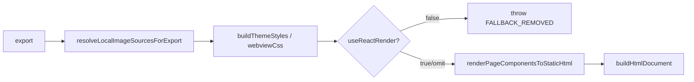

# HtmlExporter — Primary-only 構造棚卸し（Vault **T-20260421-019**）

**正本コード**: `src/exporters/html-exporter.ts`  
**目的**: **runtime truth**（`export()` は Primary のみ）と **型・継承・フィールド**の差分を固定し、後続 **T-022〜T-027** の削除／切離し判断材料にする。  
**Sprint 2（`T-20260421-022` / `023`）反映後**: `HtmlExporter` は **`Exporter` のみ実装**し、**`legacy/*` へ依存しない**（inventory §3 旧表は歴史参照）。

---

## 1. `HtmlExporter.export()` の call path（Primary）

次の経路のみが **HTML 成果物**を生成する。

```
export(dsl, options)
  → resolveLocalImageSourcesForExport (options に path がある場合)
  → buildThemeStyles (themePath)
  → readWebviewCssIfPresent
  → useReactRender === false なら throw [FALLBACK_REMOVED]
  → renderPageComponentsToStaticHtml(page.components)   // react-static-export（Base 継承と無関係）
  → buildHtmlDocument(reactBody, themeStyles, { webviewCss, noWrap: true })
```

**図（責務）**



---

## 2. 分類ルール

| ラベル | 意味 |
|--------|------|
| **runtime used** | **`export()` の Primary 経路**で直接または間接に実行される |
| **structural / ctor** | **constructor** で初期化されるが、Primary **`export()` では未到達**（子オブジェクトのためだけに存在） |
| **dead structure** | **Primary `export()` から到達しない**が、クラスに残るメソッド・フィールド（他コードが `renderXxx` を直接呼ばない限り死蔵） |

---

## 3. 依存・メンバー一覧（Sprint 2 後の現状）

| 対象 | 分類 | 説明 |
|------|------|------|
| `implements Exporter` | **runtime / 契約** | `export` / `getFileExtension` のみ。Navigation flow DSL は **`isNavigationFlowDSL` で拒否**し `html-flow` へ誘導。 |
| `renderPageComponentsToStaticHtml` | **runtime used** | Primary の中核 |
| `buildHtmlDocument` / `readWebviewCssIfPresent` | **runtime used** | ドキュメント組み立て |
| `buildThemeStyles`（private）/ `ThemeUtils` | **runtime used** | テーマ CSS |
| `resolveLocalImageSourcesForExport`（private） | **runtime used** | 画像コピー・src 書換 |
| `resolveImageSourcesInDsl` | **runtime used** | 上記から利用 |
| **`BaseComponentRenderer` / `Html*Renderer` / `renderXxx`** | **（撤去済み）** | Sprint 2 で **ファイルから削除**。再導入は **ESLint**（`eslint.config.mjs` の `src/exporters/html-exporter.ts` 専用 `no-restricted-imports`）で検出。 |

### 3b. Sprint 1 時点の旧表（アーカイブ・判断根拠）

| 対象（旧） | 分類（旧） | メモ |
|------------|------------|------|
| `extends BaseComponentRenderer` | dead structure | **T-022** で除去 |
| `HtmlFormRenderer` / `HtmlTextualRenderer` / `HtmlLayoutRenderer` | structural / ctor | **T-023** で除去 |
| 全 `protected renderXxx(...)` | dead structure | **T-023** で除去 |

---

## 4. 削除候補 vs 保留候補（更新）

| 区分 | 内容 |
|------|------|
| **完了（Sprint 2）** | **`BaseComponentRenderer` 継承**・**legacy renderer フィールド**・**`renderXxx` 群**・**`createRendererUtils`** — 実装から除去済み（**T-022** / **T-023**）。 |
| **保留（当面）** | `buildThemeStyles` 内の `console.warn`。**他 exporter** の `BaseComponentRenderer` 利用は **T-025** で縮小。 |
| **再結合防止（先行）** | `eslint.config.mjs` に **`src/exporters/html-exporter.ts` 専用**の `no-restricted-imports`（`legacy/`・`internal/`・`renderer/types`）を追加（**T-026** の意図を先行実装）。 |
| **T-024** | 新規 util モジュールは **不要**（HtmlExporter 内の private メソッドで完結）。 |

---

## 5. 外部からの呼び出し（確認済み）

`HtmlExporter` インスタンスに対して production コードが触るのは **`export(...)` のみ**。

- `src/exporters/built-in-exporter-registry.ts`
- `src/integrations/provider/html-provider-adapter.ts`
- `src/cli/provider-registry.ts`
- `src/utils/preview-capture/html-preparation.ts`

→ **`renderComponent` / `renderText` 等は `export()` 外から呼ばれない**（本 inventory 作成時点）。

---

## 6. 関連

- エピック: Vault **T-20260421-018**（E-HTML-PRIMARY-STRUCTURE）
- 境界ガイド: `docs/current/runtime-boundaries/exporter-boundary-guide.md`
- Fallback 撤去: Vault **T-20260420-090** / 実装ラベル **T-20260420-001**
- **`BaseComponentRenderer` 利用者**: [base-component-renderer-consumers.md](base-component-renderer-consumers.md)（**T-025**）

---

## 7. Sprint 3（T-025〜027）反映

- **T-025**: 上記 **consumers** ドキュメントと `base-component-renderer.ts` 先頭 JSDoc で利用者を固定。
- **T-026**: `npm run lint` 全緑を含む CI ゲートと一致（`eslint.config.mjs` の `html-exporter.ts` 専用ルールは維持）。
- **T-027**: `exporter-boundary-guide` の **T-350** 負債記述更新、`CHANGELOG` 記録、`tests/README` に構造テストの一言。
