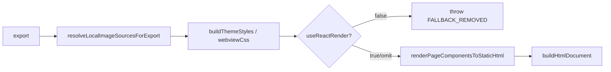

# HtmlExporter — Primary-only 構造棚卸し（Vault **T-20260421-019**）

**正本コード**: `src/exporters/html-exporter.ts`  
**目的**: **runtime truth**（`export()` は Primary のみ）と **型・継承・フィールド**の差分を固定し、後続 **T-022〜T-027** の削除／切離し判断材料にする。

---

## 1. `HtmlExporter.export()` の call path（Primary）

次の経路のみが **HTML 成果物**を生成する。

```
export(dsl, options)
  → resolveLocalImageSourcesForExport (options に path がある場合)
  → buildThemeStyles (themePath)
  → readWebviewCssIfPresent
  → useReactRender === false なら throw [FALLBACK_REMOVED]
  → renderPageComponentsToStaticHtml(page.components)   // react-static-export（Base 継承と無関係）
  → buildHtmlDocument(reactBody, themeStyles, { webviewCss, noWrap: true })
```

**図（責務）**



---

## 2. 分類ルール

| ラベル | 意味 |
|--------|------|
| **runtime used** | **`export()` の Primary 経路**で直接または間接に実行される |
| **structural / ctor** | **constructor** で初期化されるが、Primary **`export()` では未到達**（子オブジェクトのためだけに存在） |
| **dead structure** | **Primary `export()` から到達しない**が、クラスに残るメソッド・フィールド（他コードが `renderXxx` を直接呼ばない限り死蔵） |

---

## 3. 依存・メンバー一覧

| 対象 | 分類 | `export()` Primary での説明 |
|------|------|------------------------------|
| `extends BaseComponentRenderer` | **dead structure**（継承） | Primary 本体は `renderPageComponentsToStaticHtml`。**継承は歴史的**。`getFileExtension` 等の小メソッドは基底実装に依存。→ **T-022** で切離し候補 |
| `super('html')` | **structural / ctor** | 基底の状態初期化のみ。Primary HTML 生成には不要な可能性 → **T-022** |
| `HtmlFormRenderer` / `HtmlTextualRenderer` / `HtmlLayoutRenderer` | **structural / ctor** | constructor で生成。**`export()` は呼ばない**。→ **T-023** 削除候補 |
| `createRendererUtils()` | **structural / ctor** | 上記 renderer へ注入するためだけ。**`export()` 未到達** → **T-023** 削除候補 |
| 全 `protected renderXxx(...)` | **dead structure** | **外部は `export()` のみ**（`html-provider-adapter` / `provider-registry` / `html-preparation`）。文字列レンダラ経路は撤去済み → **T-023** 削除候補 |
| `renderPageComponentsToStaticHtml` | **runtime used** | Primary の中核 |
| `buildHtmlDocument` / `readWebviewCssIfPresent` | **runtime used** | ドキュメント組み立て |
| `buildThemeStyles` / `ThemeUtils` | **runtime used** | テーマ CSS |
| `resolveLocalImageSourcesForExport` | **runtime used** | 画像コピー・src 書換 |
| `resolveImageSourcesInDsl` | **runtime used** | 上記から利用 |

---

## 4. 削除候補 vs 保留候補

| 区分 | 内容 |
|------|------|
| **削除候補（後続チケット）** | `formRenderer` / `textualRenderer` / `layoutRenderer` / `createRendererUtils` / **全 `renderXxx` オーバーライド**（Primary のみなら）、**`BaseComponentRenderer` 継承の解消**（**T-022**） |
| **保留（当面）** | `buildThemeStyles` 内の `console.warn` などの観測は別チケットで整理可。**他 exporter** が `BaseComponentRenderer` を継続利用する限り基底クラス自体の削除は **T-025** 範囲 |
| **再結合防止** | **`HtmlExporter` → `legacy/html-renderers/*`** の import を **T-026** で機械ガード |

---

## 5. 外部からの呼び出し（確認済み）

`HtmlExporter` インスタンスに対して production コードが触るのは **`export(...)` のみ**。

- `src/exporters/built-in-exporter-registry.ts`
- `src/integrations/provider/html-provider-adapter.ts`
- `src/cli/provider-registry.ts`
- `src/utils/preview-capture/html-preparation.ts`

→ **`renderComponent` / `renderText` 等は `export()` 外から呼ばれない**（本 inventory 作成時点）。

---

## 6. 関連

- エピック: Vault **T-20260421-018**（E-HTML-PRIMARY-STRUCTURE）
- 境界ガイド: `docs/current/runtime-boundaries/exporter-boundary-guide.md`
- Fallback 撤去: Vault **T-20260420-090** / 実装ラベル **T-20260420-001**
