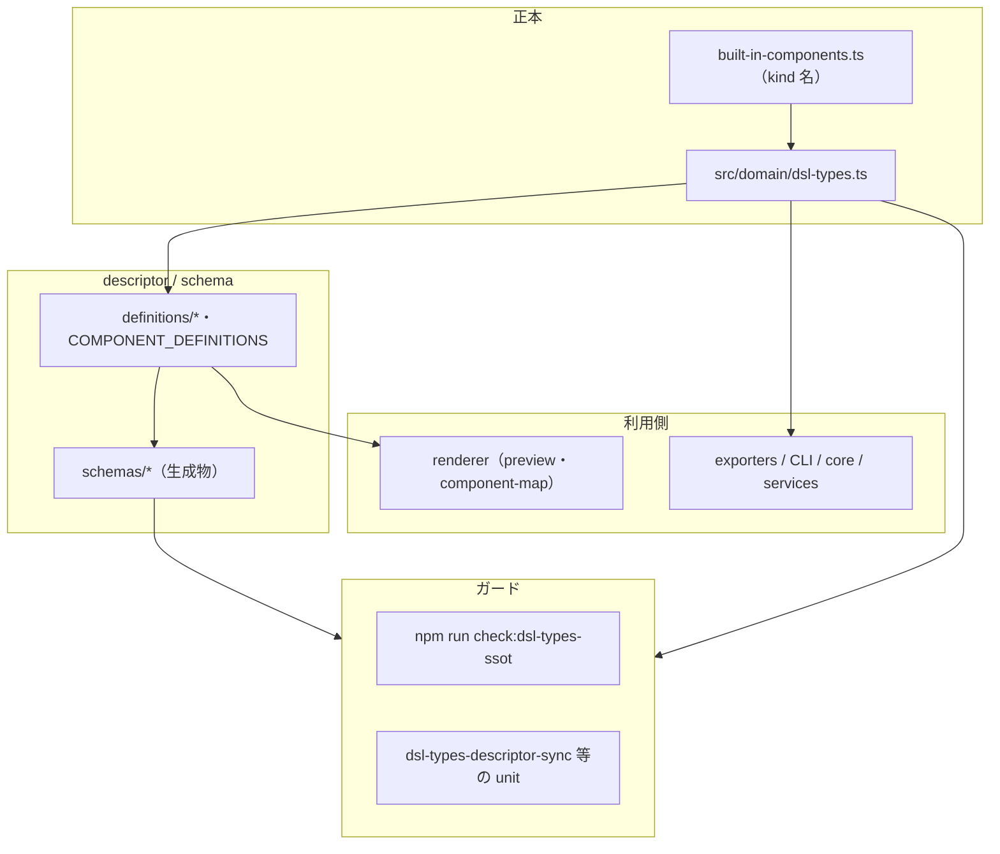

# `dsl-types` 変更の影響半径と完了監査（SSoT）

**目的**: `src/domain/dsl-types.ts` および関連する共有 DSL 型を変更したときの **作業漏れを減らす**ため、影響が広がる経路を **一枚**で追えるようにする。  
**Vault チケット**: T-20260322-158（E-DSL-SSOT-2）／エイリアス T-SSOT2-13

---

## 1. 影響半径（可視化）

`domain/dsl-types` を触ると、次の **レイヤへ同時に波及**する（change amplification）。**単一ファイル修正で完結しない**前提で読む。

詳細手順の **実務チェックリスト**は [adding-built-in-component.md](adding-built-in-component.md)（4 フェーズ）および [change-amplification-dsl.md](change-amplification-dsl.md) を正とする。

---

## 2. 整合マトリクス（文書 / lint / test / script / PR）

PM・TM が **客観的に**「SSoT 関連の締め」に使える対応表。変更種別に応じて **該当行をすべて満たす**こと。

| 区分 | 正本・役割 | 確認方法（ローカル） | CI での位置づけ |
|------|------------|----------------------|-----------------|
| **文書** | `docs/adding-built-in-component.md`・`change-amplification-dsl.md`・本ファイル | 手順と矛盾する記述がないこと（レビュー） | なし（人間／レビュー） |
| **Lint（import 境界）** | `eslint` の `no-restricted-imports`（`renderer/types` 非 renderer 禁止） | `npm run lint` | `ci.yml` の lint ジョブ |
| **Script（棚卸し）** | `scripts/check-dsl-type-imports.cjs` | `npm run check:dsl-types-ssot`（違反 0 件） | `ci.yml` で `check:dsl-types-ssot` 実行 |
| **Unit テスト** | `dsl-types-descriptor-sync`・`renderer-types-non-renderer-import-guard` 等 | `npm test`（または該当ファイルを `npx mocha`） | `npm test` / `test:all:ci` |
| **PR テンプレ** | `.github/PULL_REQUEST_TEMPLATE.md` の `ssot` 節 | SSoT 変更 PR でチェック項目が埋まっていること | なし（プロセス） |

**機械出力の一覧**: `npm run check:dsl-types-ssot` は `domain/dsl-types` / `renderer/types` の import 件数と **違反ファイル**を標準出力する（[`dsl-types-renderer-types-inventory.md`](dsl-types-renderer-types-inventory.md) 参照）。

---

## 3. PM / TM 向け・エピック完了判定チェックリスト（例）

以下を **すべて満たす**ことを「SSoT エピックの型・境界ストリーム完了」の **客観条件**の一例として使う（親エピックの定義に従う）。

- [ ] **ガード**: `npm run check:dsl-types-ssot` が **違反 0**（exit 0）。
- [ ] **テスト**: `npm test` に含まれる `dsl-types` / descriptor / `renderer/types` 境界のユニットが **失敗していない**（開発完了連絡にコマンドと結果が記載されていること）。
- [ ] **手順の正本**: [adding-built-in-component.md](adding-built-in-component.md) の **4 フェーズ**と、実装・PR の説明に矛盾がない。
- [ ] **PR 運用**: SSoT 変更時は `.github/PULL_REQUEST_TEMPLATE.md` の **`ssot` および検証節**を実施済みである。

---

## 4. 例外運用の棚卸し（期限付き）

**方針**: `renderer/types` への **非 renderer からの import** を恒久的に許容する **`eslint-disable` 等は置かない**。現状 `src/**` に **SSoT import 迂回用の disable は無い**（定期 grep で確認）。

| 日付 | 例外の内容 | 期限 / 次アクション | 状態 |
|------|------------|----------------------|------|
| 2026-03-22 | （なし）登録なし | 新規追加時は本表に1行追加し、**削除期限または親チケット**を必ず書く | 適用中 |

**無期限の例外を増やさない**: どうしても必要な場合は ADR・チケット・本表の3点セットで残す。

---

## 関連リンク

- [architecture-review-D-change-amplification-canonical.md](architecture-review-D-change-amplification-canonical.md)
- [adr/0003-dsl-types-canonical-source.md](adr/0003-dsl-types-canonical-source.md)
- [MAINTAINER_GUIDE.md](MAINTAINER_GUIDE.md)（最低限の検証コマンド）
