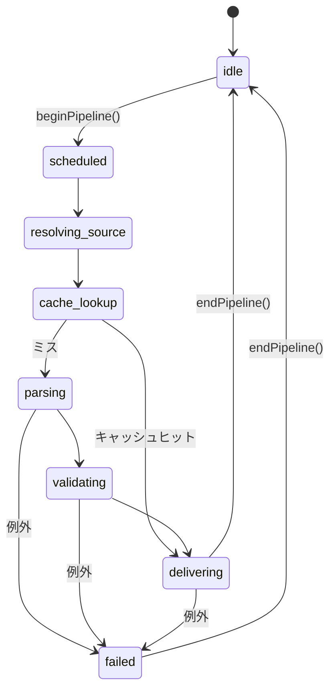

# プレビュー更新パイプライン（フェーズ遷移）

`WebViewUpdateManager.sendYamlToWebview` 内で、`PreviewUpdateCoordinator` が **1 回の送信処理**のフェーズを表す。

## キュー・デバウンスとの関係

- **UpdateQueueManager**: デバウンス・優先度キュー・最小更新間隔。タスクの `execute` が `sendYamlToWebview` を呼ぶ。
- **PreviewUpdateCoordinator**: その **1 回の呼び出し**の内部（ソース解決 → キャッシュ → パース → 配信）を追跡する。キュー上の「待ち」はここには含めない（将来、タスク開始時に `scheduled` を二重に扱わないよう整理可能）。

## フェーズ一覧（`PreviewUpdatePhase`）

| 値 | 意味 |
|----|------|
| `idle` | パイプライン外 |
| `scheduled` | `isUpdating` ロック取得直後、処理本体の開始 |
| `resolving_source` | キャッシュキー用に現在の YAML テキストを解決 |
| `cache_lookup` | メモリキャッシュのヒット判定 |
| `parsing` | `YamlParser.parseYamlFile`（YAML パース・include・**スキーマ検証を内包**） |
| `validating` | パース完了後、キャッシュ保存と配信の直前（スキーマ検証自体は `parsing` 内で完了） |
| `delivering` | `postMessage` による WebView への配信 |
| `failed` | 例外捕捉（直後に `idle` に戻る） |

## 遷移図（概略）

## 実装上の注意

- **スキーマ検証**は `YamlParser` 内部で実行されるため、`parsing` と `validating` の境界は「非同期 1 呼び出し」の前後で表現している。検証だけを別フェーズに細分化する場合は `YamlParser` 側の分割が必要になる。

## 関連コード

- `src/services/webview/preview-update-coordinator.ts`
- `src/services/webview/webview-update-manager.ts`（`getPreviewUpdatePhase()`）
