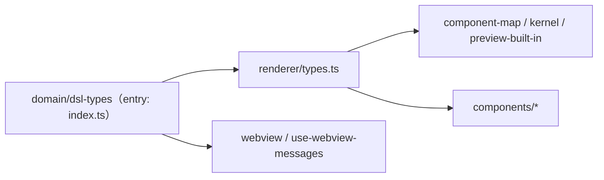

# SSoT renderer/types 依存棚卸し

本メモは `renderer/types` 依存の棚卸し結果を、実装レイヤごとに短く参照できるようにまとめたものです。

## レイヤ別サマリ

- renderer: `src/renderer/types.ts` を thin facade として維持。
- core: `renderer/types` の直接参照は未検出。
- exporters: `domain/dsl-types` 参照中心。ガード追加で逸脱を検知。
- cli / utils / registry / types: `renderer/types` 直接参照の混入をガードで検知。
- tests: SSoT ガード系テストで境界逸脱を検知。

Related next-step planning: [ssot-renderer-sprint3-candidates.md](ssot-renderer-sprint3-candidates.md)

## Sprint 3 Closeout (T-301 / T-302)

- `T-301`: the inventory pass is now aligned with the current repo state and shows entry / kernel / preview / component lanes separately.
- `T-302`: the WebView entry files already import `domain/dsl-types` directly, so entry migration is no longer pending work.
- The next implementation slice starts at the renderer kernel boundary: `component-map.tsx`, `registered-component-kernel.tsx`, and `preview-diff.ts`.
- `preview-built-in-renderers.tsx` and `components/*` stay deferred until the kernel slice lands cleanly.

## 運用メモ

- 新規の共有 DSL 型は `domain/dsl-types` を正本として追加する。
- 互換窓口として `renderer/types` を使う場合は理由を明記し、段階的縮退を前提にする。
- `renderer/types` は thin facade（再エクスポート専用）として維持し、型本体の追加を禁止する。
- 削除検討は「全レイヤ参照ゼロ」「domain 直参照で build/test 緑」「移行影響文書化」を満たしたときに行う。

---

## `src/renderer/**` 内の `types` 参照一覧（2026-03-22 棚卸し・T-166）

**正本**: `src/domain/dsl-types/（公開エントリ: index.ts）`（ADR 0003）。**窓口**: `src/renderer/types.ts` は `export * from '../domain/dsl-types'` のみ。

### 分類キー

| 分類 | 意味 |
|------|------|
| **facade** | `types.ts` 本体（再エクスポートのみ） |
| **entry** | WebView エントリ・メッセージ（ユーザー向けプレビュー UI の根） |
| **kernel** | 登録コンポーネント・component-map・プレビュー built-in |
| **preview** | DSL 差分・プレビュー補助 |
| **component** | `components/*` 各ビルトイン（`../types` 経由） |

### ファイル一覧（import 元が `./types` または `../types`。**例外**は脚注）

| ファイル | 分類 | 主なimportシンボル（型） |
|----------|------|---------------------------|
| `types.ts` | facade | `export *` from `domain/dsl-types` |
| `webview.tsx` | entry | `TextUIDSL`, `ComponentDef` — **`../domain/dsl-types` 直参照（T-167 PoC）** |
| `use-webview-messages.ts` | entry | `TextUIDSL` — **`../domain/dsl-types` 直参照（T-167 PoC）** |
| `component-map.tsx` | kernel | `ComponentDef` |
| `registered-component-kernel.tsx` | kernel | `ComponentDef` |
| `preview-built-in-renderers.tsx` | kernel | （複数・`./types`） |
| `preview-diff.ts` | preview | `ComponentDef`, `TextUIDSL` |
| `components/Accordion.tsx` | component | `AccordionComponent`, `ComponentDef` |
| `components/Alert.tsx` | component | `AlertComponent` |
| `components/Badge.tsx` | component | `BadgeComponent`, `BadgeVariant` |
| `components/Breadcrumb.tsx` | component | `BreadcrumbComponent` |
| `components/Button.tsx` | component | `ButtonComponent` |
| `components/Checkbox.tsx` | component | `CheckboxComponent` |
| `components/Container.tsx` | component | `ContainerComponent` |
| `components/DatePicker.tsx` | component | `DatePickerComponent` |
| `components/Divider.tsx` | component | `DividerComponent` |
| `components/Form.tsx` | component | `FormComponent`, `FormField`, `FormAction` |
| `components/Icon.tsx` | component | `IconComponent` |
| `components/Image.tsx` | component | `ImageComponent` |
| `components/Input.tsx` | component | `InputComponent` |
| `components/Link.tsx` | component | `LinkComponent` |
| `components/Progress.tsx` | component | `ProgressComponent`, `ProgressVariant` |
| `components/Radio.tsx` | component | `RadioComponent`, `RadioOption` |
| `components/Select.tsx` | component | `SelectComponent`, `SelectOption` |
| `components/Spacer.tsx` | component | `SpacerComponent` |
| `components/Table.tsx` | component | `ComponentDef`, `TableComponent`, `isComponentDefValue` |
| `components/Tabs.tsx` | component | `ComponentDef`, `TabsComponent` |
| `components/Text.tsx` | component | `TextComponent` |
| `components/TreeView.tsx` | component | `ComponentDef`, `TreeViewComponent`, `TreeViewItem` |

### 依存の読み方（簡易）

**観察**: `renderer` 配下では **型の実体は常に domain に集約**され、`types.ts` は **単一の再エクスポート窓口**（entry は T-167 で **窓口をバイパスして domain 直参照**する PoC を実施）。縮退・削除判断では「`types.ts` を廃止して各ファイルを `domain/dsl-types` に直す」か「プレビュー専用型を `preview-types.ts` に分離する」かを **PoC・ADR（T-167/T-168）** で段階的に決める。

### 次工程への手渡し（T-167 / T-168）

- **PoC**: [ssot-webview-dsl-types-direct-import-poc.md](./ssot-webview-dsl-types-direct-import-poc.md)（WebView 入口の `domain/dsl-types` 直参照試行・T-167）。
- **ADR 補遺**: ADR 0003 / `MAINTAINER_GUIDE` の更新は T-168 スコープ。
